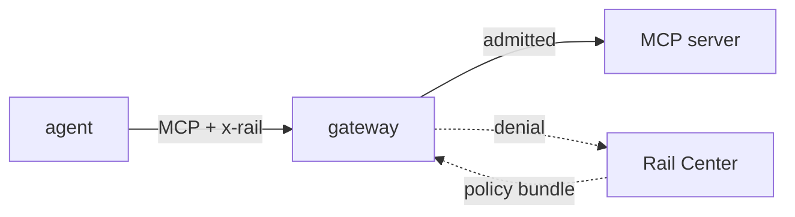

# DatRail Gateway

An enforcement point that reads the `x-rail` ticket on an agent's MCP calls and decides, against policy published by Rail Center, whether each one reaches the service behind it.

It sits in front of an MCP server as a transparent proxy. Admitted calls are forwarded and answered as though it were not there; refused ones are answered `403` and reported to the control plane. It holds a cached copy of the policy bundle and refreshes it on an interval, so deciding a call never waits on Rail Center — and a control plane that is down costs freshness rather than availability.



## See it work

No Rail Center and no agent required — the stack stubs both and asserts what crossed the wire:

```bash
docker compose -f e2e/compose.yml up --build --force-recreate --abort-on-container-exit --exit-code-from driver
docker compose -f e2e/compose.yml down -v --remove-orphans
```

Three gateways, one per mode, against a stubbed control plane and a stubbed MCP server. A policy is fetched, a call is refused, a denial is reported, and twenty-two assertions check the request journals rather than the logs. The exit code of the first command is the result; the second is the teardown. `--force-recreate` is part of the command rather than a nicety: one assertion counts bundle fetches in a journal nothing resets, so a stub left running by an earlier run makes it read high. [`e2e/README.md`](e2e/README.md) explains what each assertion is for.

## Run it

```bash
docker run --rm -p 8080:8080 \
  -e RAIL_GATEWAY_UPSTREAM_URL=http://your-mcp-server:8000/mcp \
  -e RAIL_CENTER_URL=https://rail-center.example \
  -e RAIL_DATASOURCE_SLUG=delivery \
  ghcr.io/datrail/gateway:latest
```

[`.env.example`](.env.example) lists every variable this gateway reads, and only those, with what each one costs to get wrong. Three have no default and are refused at startup rather than guessed at.

`RAIL_DATASOURCE_SLUG` is the one worth checking twice. It is the first segment of every endpoint key the gateway composes — `delivery` makes `delivery.track_package` — and it must be the slug the data source was registered under, because that is what Rail Center keys the bundle's bindings on. A wrong slug composes keys matching no binding, so every endpoint silently falls back to the whole chain rather than failing.

### The three modes

`RAIL_TICKET_MODE` is how much of the decision this gateway acts on. It is platform-wide rather than this component's own — the proxy in front reads the same variable — so one value configures a whole zone.

| | evaluates | refuses | reports | needs a control plane |
|---|---|---|---|---|
| `none` | — | — | — | no |
| `observe` | yes | — | — | yes |
| `enforce` *(default)* | yes | yes | yes | yes |

`observe` is the dry run: the same walk, the same verdict in the log, and nothing acted on. It is what a deployment turns on first to see what enforcement *would* refuse, and what it rolls back to. `none` fetches no bundle and reads no control-plane configuration at all.

### Routes

`/health` is liveness and `/ready` is readiness, and the distinction is the point of having both. `/ready` answers `503` until a bundle is held, except under `RAIL_TICKET_MODE=none`, which builds no holder and so is ready at once — a pass-through has no bundle to wait for, and reporting one unready would leave the mode that turns enforcement off as the one that never serves. `/health` consults a bundle in no mode. A gateway that has never reached its control plane is unhealthy to a deployment gate and forwards traffic exactly as one that has — readiness reports, it does not gate.

`/mcp` is the proxied endpoint. A refusal is answered there as an HTTP status, above the MCP layer, rather than as a JSON-RPC error inside a `200`.

## What it enforces

The walk is specified by Rail Center's policy evaluation contract, and this is an implementation of it rather than a description. Three of its rules are the ones that surprise people:

- **A message that names no endpoint is judged by the rules that can ask about it, and by no others.** `initialize` names no tool, so rules keyed on `endpoint_key` are dropped from its chain — which is why a ticket can open a session and still be refused on the one call a rule names.
- **A refusal is not a denial.** A request the ruleset could not be applied to — no bundle held, or a condition outside this reader's grammar — is answered `503` and reported nowhere. Naming a policy in a report is the only thing that makes it the policy that decided.
- **A failed fetch is not an empty ruleset.** A control plane that answers nothing leaves the last good bundle in place; it does not admit everything.

The three published schemas — [`schemas/`](schemas/) — are the wire contracts: the ticket, the policy bundle, and the denial event. Each carries the rules that are about meaning rather than shape, which no schema can express.

## What it does not establish

**The `x-rail` ticket is unsigned.** `agent_id` and `posture_score` are chosen by whoever sent the request. They are evaluated and reported because an operator wants to know what was claimed, never because they are established — a reader treating either as identity has misread the contract.

**Denial attribution is asserted, not derived.** Rail Center records the policy this gateway names and does not re-derive it, so there is nothing downstream to catch a wrong id.

## Development

```bash
python -m venv .venv && . .venv/bin/activate
pip install -r requirements-test.txt -r requirements-dev.txt   # -test pulls in the runtime deps
make test        # python -m pytest -q
make lint        # ruff check, and ruff format --check
```

The gate is the Makefile rather than the workflow, so the command CI runs is the one you can run before opening a pull request.

The suite runs a real upstream and a real gateway under uvicorn on ephemeral ports, because the gateway reaches its upstream as an MCP client and an in-process transport would exercise a shape no deployment has. [`CONTRIBUTING.md`](CONTRIBUTING.md) covers sending a change.

---

Apache-2.0 — see [LICENSE](LICENSE) and [NOTICE](NOTICE). Sending a change: [CONTRIBUTING.md](CONTRIBUTING.md). Taking part: [CODE_OF_CONDUCT.md](CODE_OF_CONDUCT.md). Security reports go to [SECURITY.md](SECURITY.md) rather than a public issue.
