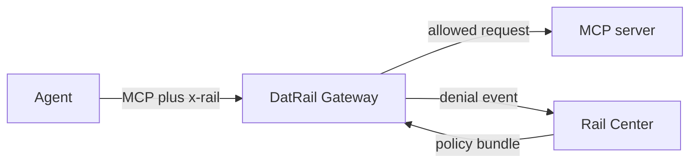

# DatRail Gateway

DatRail Gateway is the enforcement point in the open-source DatRail request
path. It sits in front of an MCP server, reads the `x-rail` ticket attached by
[DatRail Proxy](https://github.com/datrail/proxy), evaluates the request against
a policy bundle from Rail Center, and forwards or refuses the call.

## Quick start

Run the self-contained end-to-end stack (Docker with Compose v2 is required):

```bash
git clone https://github.com/datrail/gateway.git
cd gateway
docker compose -f e2e/compose.yml up --build --force-recreate \
  --abort-on-container-exit --exit-code-from driver
docker compose -f e2e/compose.yml down -v --remove-orphans
```

To proxy a real MCP server:

```bash
docker run --rm -p 8080:8080 \
  -e RAIL_GATEWAY_UPSTREAM_URL=http://your-mcp-server:8000/mcp \
  -e RAIL_CENTER_URL=https://rail-center.example.com \
  -e RAIL_DATASOURCE_SLUG=delivery \
  ghcr.io/datrail/gateway:latest
```

See [`.env.example`](.env.example) for the complete configuration. `/health`
reports liveness, `/ready` reports whether a policy bundle is available, and
`/mcp` is the proxied endpoint.

## Architecture



`RAIL_TICKET_MODE` selects `none`, `observe`, or `enforce`. Decisions use the
last valid policy bundle, so a failed refresh does not silently become an empty
policy. The schemas in [`schemas/`](schemas/) define the ticket, bundle, and
denial-event wire shapes.

## Security

The current `x-rail` format is unsigned. Its agent identity and posture are
claims, not cryptographically established identity. Keep the gateway behind
the intended network boundary, use TLS for non-local control-plane and upstream
connections, and read [SECURITY.md](SECURITY.md) before production use. Report
vulnerabilities privately through GitHub Security Advisories, not a public
issue.

## Development

```bash
python -m venv .venv
. .venv/bin/activate
pip install -r requirements-test.txt -r requirements-dev.txt
make test
make lint
```

## Related projects

- [DatRail Proxy](https://github.com/datrail/proxy) injects `x-rail` tickets.
- [RailMon](https://github.com/datrail/railmon) observes agent traffic.
- [RailDash](https://github.com/datrail/raildash) presents captures locally.

## License

Apache-2.0. See [LICENSE](LICENSE) and [NOTICE](NOTICE).
