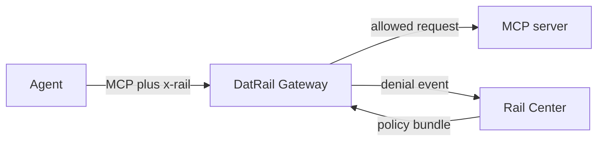

# DatRail Gateway

DatRail Gateway is the enforcement point in the open-source DatRail request
path. It sits in front of an MCP server, reads the `x-rail` ticket attached by
[DatRail Proxy](https://github.com/datrail/proxy), evaluates the request against
a policy bundle from Rail Center, and forwards or refuses the call.

## Quick start

Run the self-contained end-to-end stack (Docker with Compose v2 is required):

```bash
git clone https://github.com/datrail/gateway.git
cd gateway
docker compose -f e2e/compose.yml up --build --force-recreate \
  --abort-on-container-exit --exit-code-from driver
docker compose -f e2e/compose.yml down -v --remove-orphans
```

To proxy a real MCP server:

```bash
docker run --rm -p 8080:8080 \
  -e RAIL_PLUGIN_ENABLED=true \
  -e RAIL_CENTER_URL=https://rail-center.example.com \
  -e RAIL_GATEWAY_SLUG=edge \
  -v "$PWD/routes.yaml:/etc/rail/routes.yaml:ro" \
  ghcr.io/datrail/gateway:latest
```

See [`.env.example`](.env.example) for the complete configuration. `/health`
reports liveness, `/ready` reports whether a policy bundle is available, and
`/mcp` is the proxied endpoint.

## What it fronts

One gateway fronts several MCP servers, named in a routes file:

```yaml
schema_version: "1.0"
mcp:
  servers:
    - name: delivery
      url: http://delivery-mcp:9000/mcp
      prefix: /delivery
    - name: finretail
      url: http://finretail-mcp:9001/mcp
      prefix: /finretail
```

`prefix` defaults to `/`, the single-upstream deployment, where the gateway
listens at its root and strips nothing. Every entry in a file naming more than
one upstream carries a prefix of its own: `/` overlaps every other prefix, and
the pair is refused at startup.

`prefix` is where this gateway listens for that upstream, and it is the only
thing that decides routing — an MCP `tools/call` names a tool and nothing else,
so two upstreams reachable at one address are indistinguishable in the message.
**Overlapping prefixes are refused at startup**: a request matching two routes
has no answer this gateway could give, and resolving it by longest-match is a
rule an operator did not write and cannot see. The prefix is removed before the
request is forwarded, and travels on as `X-Forwarded-Prefix` to what the gateway
serves beneath it rather than to the upstream, which is sent none of the
incoming headers.

`name` is a label. It appears in logs and nowhere else, and it is **not** a Rail
Center data source slug.

**These components front MCP servers only.** The enforcement layer judges `POST`
alone, resolution reads a JSON-RPC body, and the proxy beneath speaks MCP — an
HTTP API behind this gateway is forwarded but never judged.

## Endpoint keys, and the constraint they place on you

Rail Center composes `<slug>#<path>#<method>#<call>` and publishes that whole
key. This gateway holds no data source slug — it fronts several data sources and
a data source may sit behind several gateways, so nothing local can name that
relationship — so it composes `<path>#<method>#<call>` from the request and
strips the first segment off each of the bundle's keys to meet it.

`<path>` is the path **the upstream serves**, not the one the caller dialled:
the route prefix is removed first. That is what keeps one endpoint to one key,
since the same MCP server behind two gateways at different prefixes would
otherwise produce two keys for one row.

**Only a `tools/call` composes a key.** An endpoint is a tool, so every other
method carries none, is matched against no binding, and is never reached by the
fallback.

**Endpoint keys must be unique within one gateway once the slug is stripped.**
Two data sources behind one gateway, both serving `/mcp`, both with a `search`
tool, reach this gateway as one key. Rail Center does not enforce this and is not
asked to; **this gateway refuses a bundle that violates it**, naming both full
keys, because serving either binding would be the gateway choosing on your
behalf. A binding whose key cannot be read at all is logged and skipped instead —
it narrows one endpoint and says nothing about the others.

## Architecture



`RAIL_PLUGIN_ENABLED` says whether RailXia is installed on this deployment at
all: false is a plain gateway that contacts no control plane, true one that
polls Rail Center for its policy bundle by `RAIL_GATEWAY_SLUG` — the gateway's
own identity, and not any data source's. **How much of a
decision it acts on is the bundle's to say, not the deployment's** — the bundle
carries an `enforcement` posture, so moving a gateway between judging nothing,
reporting and refusing is a poll rather than a redeploy. Decisions use the last valid policy bundle, so a failed
refresh does not silently become an empty policy. The schemas in
[`schemas/`](schemas/) define the ticket, bundle, and denial-event wire shapes.

## Security

The current `x-rail` format is unsigned. Its agent identity and posture are
claims, not cryptographically established identity. Keep the gateway behind
the intended network boundary, use TLS for non-local control-plane and upstream
connections, and read [SECURITY.md](SECURITY.md) before production use. Report
vulnerabilities privately through GitHub Security Advisories, not a public
issue.

## Development

```bash
python -m venv .venv
. .venv/bin/activate
pip install -r requirements-test.txt -r requirements-dev.txt
make test
make lint
```

## Related projects

- [DatRail Proxy](https://github.com/datrail/proxy) injects `x-rail` tickets.
- [RailMon](https://github.com/datrail/railmon) observes agent traffic.
- [RailDash](https://github.com/datrail/raildash) presents captures locally.

## License

Apache-2.0. See [LICENSE](LICENSE) and [NOTICE](NOTICE).
