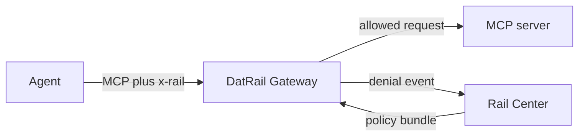

# DatRail Gateway

DatRail Gateway is the enforcement point in the open-source DatRail request
path. It sits in front of an MCP server, reads the `x-rail` ticket attached by
[DatRail Proxy](https://github.com/datrail/proxy), evaluates the request against
a policy bundle from Rail Center, and forwards or refuses the call.

## Quick start

Run the self-contained end-to-end stack (Docker with Compose v2 is required):

```bash
git clone https://github.com/datrail/gateway.git
cd gateway
make e2e
```

To run it in front of a real MCP server, see
[gateway-standalone](gateway-standalone/README.md); behind an Apigee proxy,
[gateway-apigee-grpc](gateway-apigee-grpc/README.md).

## Architecture


```mermaid
flowchart LR
  agent[Agent] -->|MCP plus x-rail| gateway[DatRail Gateway]
  gateway -->|allowed request| server[MCP server]
  center[Rail Center] -->|policy bundle| gateway
  gateway -->|denial event| center
```

The gateway and [DatRail Proxy](https://github.com/datrail/proxy) have
separate, responsibility-specific cores: the proxy obtains and injects an opaque
ticket, the gateway parses it and makes an enforcement decision. They share no
runtime library, and their only shared boundary is the `x-rail` wire contract,
which keeps the proxy from learning claims it must treat as opaque.

The gateway targets `x-rail` `v1.0`, at `datrail/x-rail-spec` commit
`1282f71495d9b585b6562255f5194f0754e3d586`. A wire change lands in
x-rail-spec first, under a new version; the proxy and the gateway then update
this pin and their conformance tests. The gateway's release versions do not
version the wire contract.

The schemas in [`schemas/`](schemas/) define the ticket, bundle, and
denial-event wire shapes.

Each interface puts the gateway in the agent's path in its own way: see
[gateway-standalone's](gateway-standalone/README.md#architecture) and
[gateway-apigee-grpc's](gateway-apigee-grpc/README.md#architecture)
architectures.

## Layout

Each part is its own package in one [uv workspace](https://docs.astral.sh/uv/concepts/projects/workspaces/),
with one `uv.lock` pinning every dependency, and each image installs only the
packages it runs:

| Package | Import | What it holds |
|---|---|---|
| [gateway-core](gateway-core/README.md) | `gateway.core` | `x-rail` parsing, endpoint resolution, policy ingestion and decisions |
| [gateway-standalone](gateway-standalone/README.md) | `gateway.standalone` | FastMCP/Starlette host, process configuration and routes file; its Dockerfile builds `ghcr.io/datrail/gateway` |
| [gateway-apigee-grpc](gateway-apigee-grpc/README.md) | `gateway.apigee_grpc` | Apigee ExternalCallout service and its reference proxy bundle; its Dockerfile builds `ghcr.io/datrail/gateway-apigee-grpc` |

Dependencies point one way: every interface imports the vendor-neutral core,
and the core imports no interface. More generally, a package imports only the
packages its `pyproject.toml` declares, and
[`test_architecture.py`](gateway-core/tests/test_architecture.py) enforces it.

A new interface is a `gateway-<name>/` package importing as `gateway.<name>`,
with its own Dockerfile and image. Name it after its extension mechanism, not a
cloud vendor (`gateway-ext-proc`, not `gateway-gcp`), so one implementation can
serve every platform that speaks that mechanism. A mechanism only one product
has is named with it: `gateway-apigee-grpc` is Apigee's ExternalCallout, over
gRPC.

## Security

The current `x-rail` format is unsigned. Its agent identity and posture are
claims, not cryptographically established identity. Keep the gateway behind
the intended network boundary, use TLS for non-local control-plane and upstream
connections, and read [SECURITY.md](SECURITY.md) before production use. Report
vulnerabilities privately through GitHub Security Advisories, not a public
issue.

## Development

Requires [uv](https://docs.astral.sh/uv/), which also installs the Python
version in `.python-version`.

```bash
make init    # uv sync: every member, editable, plus the pinned dev tools
make test
make lint    # `make fmt` formats and fixes instead of only checking
make e2e     # each image against a stubbed Rail Center and upstream; see e2e/README.md
make dump-enforcement-cases  # the enforcement contract table as JSON; see gateway-core/README.md
```

## Related projects

- [datrail-project](https://github.com/datrail/datrail-project#readme) is the
  entry point to DatRail: how the components fit together, and a quick start for
  RailMon and RailDash. The
  [DatRail glossary](https://github.com/datrail/datrail-project/blob/master/docs/glossary.md)
  defines the terms they share.
- [DatRail Proxy](https://github.com/datrail/proxy) injects `x-rail` tickets.
- [RailMon](https://github.com/datrail/railmon) observes agent traffic.
- [RailDash](https://github.com/datrail/raildash) presents captures locally.

## License

Apache-2.0. See [LICENSE](LICENSE) and [NOTICE](NOTICE).
