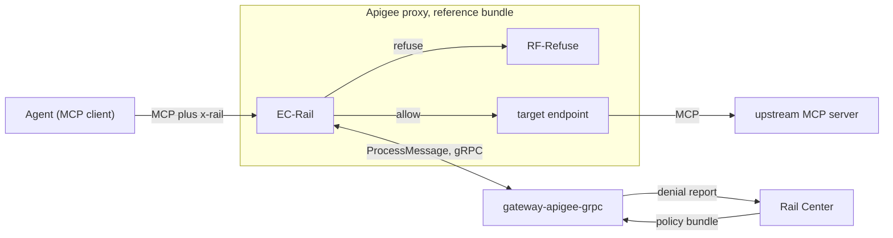

# gateway-apigee-grpc

`gateway.apigee_grpc`, an Apigee ExternalCallout service that runs
[gateway-core](../gateway-core/README.md) for an Apigee proxy. Apigee calls it
on each request, and it says whether to forward or refuse. Its Dockerfile
builds `ghcr.io/datrail/gateway-apigee-grpc`. See the
[main README](../README.md) for the whole.

## Architecture



The proxy's `EC-Rail` policy sends the callout each request: its path, its
headers and its body. The callout judges a `POST` as standalone does and
answers with flow variables: `rail.decision`, and for a refusal `rail.status`
and `rail.body`, which `RF-Refuse` answers with. Every other method is allowed.

- **The agent's headers reach the upstream as sent**, `Authorization`
  included, except `x-rail` and `x-rail-*`, which the callout removes.
- **The endpoint key's path is the path the agent called**, the proxy's base
  path included, without the query: bindings name it.
- **The callout never answers the agent itself.** Apigee forwards or refuses,
  as the answer says.

### When the callout is down

The proxy fails closed. Unreachable, past `TimeoutMs`, refused by Cloud
Run's IAM, or a gRPC error: the bundle's `RF-CalloutFailed` answers 503
`{"error": "policy ruleset cannot be applied"}`, standalone's answer when it
can't judge a call, and nothing reaches the upstream. So a callout outage is
an MCP outage. Apigee's fault and analytics show the callout failed; the
callout's own log shows nothing.

An error inside a working callout is the other way round: it logs the
traceback and allows the request, as standalone does when its walk raises.

### At startup

The callout waits up to 5 s for the first bundle, then serves whether or not
it holds one. With no bundle held, calls are allowed, and readiness is
`NOT_SERVING` until one arrives. A failed fetch doesn't stop it.

## Run it beside Apigee

- **The image** is `ghcr.io/datrail/gateway-apigee-grpc`, released with the
  same versions as `ghcr.io/datrail/gateway`. It runs as uid 10001 and serves
  gRPC, in plaintext, on port 8080.
- **The proxy:** the [reference bundle](apigee/README.md) and its
  TargetServer, with their placeholders replaced. Keep request streaming off,
  as the bundle has it: a streamed request reaches the callout with no
  content, and an empty body may be refused.
- **On Cloud Run**, as the [live harness](../e2e/apigee-grpc/live/README.md)
  runs it:
  - `--use-http2`: gRPC needs HTTP/2 end to end;
  - `--no-allow-unauthenticated`, and `roles/run.invoker` on the callout for
    the proxy's service account; deploy the proxy with that service account,
    since `EC-Rail` sends its ID token. An IAM change can take minutes to
    apply, and until then the proxy answers 503;
  - `--min-instances=1`: a cold start longer than `TimeoutMs` is a 503;
  - a startup probe on gRPC service `datrail.gateway.Ready` holds traffic
    back until a bundle is held.
- **Elsewhere**, nothing checks who calls the callout: see the bundle's
  caveats.

Measured on the G2 prototype, `EC-Rail` takes 19–29 ms warm, against Cloud
Run in the same region as the Apigee instance. Every request pays it, `GET`
and `DELETE` included.

[`e2e/apigee-grpc`](../e2e/apigee-grpc/compose.yml) runs the callout behind a
stand-in for Apigee.

## Configuration

It reads the variables every interface shares: see
[gateway-core's configuration](../gateway-core/README.md#configuration).
[`.env.example`](../.env.example) lists every variable.

#### `RAIL_GATEWAY_GRPC_MAX_MESSAGE_MB`

The largest gRPC message the callout receives, in MiB; it sends up to 1 KiB
more, since the answer echoes the body. Defaults to `16`; blank is the
default. Not an integer, or outside 1–100, is refused. The value is logged at
startup.

The limit counts the whole message, headers and path too, so leave a margin
over the largest body. Over it, gRPC refuses the call before the callout sees
it: the proxy answers 503 and the callout logs nothing, so Apigee's fault is
the place to look. Apigee's own limit is lower (see Caveats).

## Health

gRPC health (`grpc.health.v1`), on the serving port:

- the empty service name is liveness: `SERVING` once the port is bound;
- `datrail.gateway.Ready` is readiness: `NOT_SERVING` until a bundle is held,
  and `SERVING` with the plugin off.

`python -m gateway.apigee_grpc.probe_health [--ready]` asks either on this
host, and exits 0 on `SERVING`: use it as an exec probe where a gRPC probe
isn't available.

## Caveats

- **Apigee accepts a callout answer of at most 4 MiB.** Measured on Apigee X
  (2026-10-08); Apigee doesn't document it, and no setting was found to
  raise it. The answer carries the request body back (with no content in
  it, Apigee forwards an empty body), so a call whose body is over about
  4 MiB fails at Apigee after the callout has answered. The
  [reference bundle](apigee/README.md) then answers 503
  `{"error": "policy ruleset cannot be applied"}`, as for an outage, while
  the callout's log shows an ordinary verdict. `RAIL_GATEWAY_GRPC_MAX_MESSAGE_MB`
  doesn't change this. The live e2e driver pins it: a 3.5 MiB call is
  forwarded, a 5 MiB one gets that 503.
- **A comma in `x-rail-status` splits the claim**, so the callout drops it
  where standalone records it whole: Apigee splits header values on commas,
  and the callout can't tell a comma from two header lines.
- **Apigee turns a 405 without `Allow` into a 502**, where standalone passes
  it on. HTTP requires `Allow`; an MCP server that omits it breaks through
  Apigee.
- **Apigee X and hybrid only:** Apigee Edge has no ExternalCallout.

## From source

Build the image, from the repository root:

```bash
docker build -f gateway-apigee-grpc/Dockerfile -t gateway-apigee-grpc .
```

Or run it with uv:

```bash
make init
RAIL_PLUGIN_ENABLED=true RAIL_CENTER_URL=https://rail-center.example.com \
  RAIL_GATEWAY_SLUG=edge uv run python -m gateway.apigee_grpc
```

The generated gRPC code is committed: `make proto` regenerates it from the
vendored proto, and `make proto-check` checks both.
