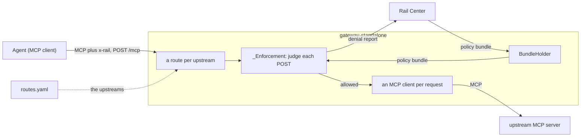

# gateway-standalone

`gateway.standalone`, the FastMCP/Starlette host that runs
[gateway-core](../gateway-core/README.md) in front of MCP servers: process
configuration, the routes file, and the HTTP server. Its Dockerfile builds
`ghcr.io/datrail/gateway`. See the [main README](../README.md) for the whole.

## Architecture



The gateway judges each call, refuses it with a `403` above the MCP layer, or
forwards it through its own MCP client:

- **None of the agent's headers reach an upstream**, `x-rail` included. The
  upstream sees only the client's own headers, plus a Basic `Authorization`
  where the route's URL carries `user:password@`.
- **`X-Forwarded-Prefix`** goes to the gateway's own sub-app for that route,
  not to the upstream. One sent by the agent is removed.
- **Startup waits up to 5 s for the first bundle**, before the port is bound.
  A failed fetch doesn't stop it.
- **With no bundle held, calls are forwarded**, and `/ready` answers `503`.

## Run

To front a real MCP server:

```bash
docker run --rm -p 8080:8080 \
  -e RAIL_PLUGIN_ENABLED=true \
  -e RAIL_CENTER_URL=https://rail-center.example.com \
  -e RAIL_GATEWAY_SLUG=edge \
  -v "$PWD/routes.yaml:/etc/rail/routes.yaml:ro" \
  ghcr.io/datrail/gateway:latest
```

`RAIL_PLUGIN_ENABLED` says whether RailXia is installed on this deployment at
all: false is a plain gateway that contacts no control plane, true one that
polls Rail Center for its policy bundle by `RAIL_GATEWAY_SLUG` — the gateway's
own identity, and not any data source's. What it does with the bundle is
[gateway-core](../gateway-core/README.md#the-policy-bundle)'s to say.

The default port is 8080, where DatRail Proxy's is 8091, so the two can run on
one host.

## Configuration

It reads the variables every interface shares: see
[gateway-core's configuration](../gateway-core/README.md#configuration).
[`.env.example`](../.env.example) lists every variable.

#### `RAIL_GATEWAY_ROUTES_FILE`

The routes file: the MCP servers this gateway fronts. Required in every mode.
Defaults to `/etc/rail/routes.yaml`, which the image does not ship, so a
container started without one mounted stops rather than coming up empty.

```yaml
schema_version: "1.0"
mcp:
  servers:
    - name: delivery
      url: http://delivery-mcp:9000/mcp
      prefix: /delivery
    - name: finretail
      url: http://finretail-mcp:9001/mcp
      prefix: /finretail
```

`prefix` defaults to `/`, the single-upstream deployment, where the gateway
listens at its root and strips nothing. Every entry in a file naming more than
one upstream carries a prefix of its own: `/` overlaps every other prefix, and
the pair is refused at startup.

`prefix` is where this gateway listens for that upstream, and it is the only
thing that decides routing — an MCP `tools/call` names a tool and nothing else,
so two upstreams reachable at one address are indistinguishable in the message.
**Overlapping prefixes are refused at startup**: a request matching two routes
has no answer this gateway could give, and resolving it by longest-match is a
rule an operator did not write and cannot see. The prefix is removed before the
request is forwarded.

`name` is a label. It appears in logs and nowhere else, and it is **not** a Rail
Center data source slug.

**These components front MCP servers only.** The enforcement layer judges `POST`
alone, resolution reads a JSON-RPC body, and the proxy beneath speaks MCP — an
HTTP API behind this gateway is forwarded but never judged.

How a call to a route becomes the key a policy binds, and the constraint that
places on which upstreams can share one gateway, is in
[gateway-core](../gateway-core/README.md#endpoint-keys-and-the-constraint-they-place-on-you).

## Endpoints

- `POST <prefix>/mcp`: the proxied MCP endpoint, one per route.
- `GET /health`: liveness, `200` once the process is up and its configuration
  parsed. It says nothing about the bundle.
- `GET /ready`: `200` once a policy bundle is held, `503` until then. With the
  plugin off, always `200`. Both stay at the root whatever the prefixes.

## From source

Build the image, from the repository root:

```bash
docker build -f gateway-standalone/Dockerfile -t gateway .
```

Or run it with uv:

```bash
make init
cp e2e/standalone/routes.yaml routes.yaml   # then edit it
RAIL_GATEWAY_ROUTES_FILE=routes.yaml uv run python -m gateway.standalone
```
